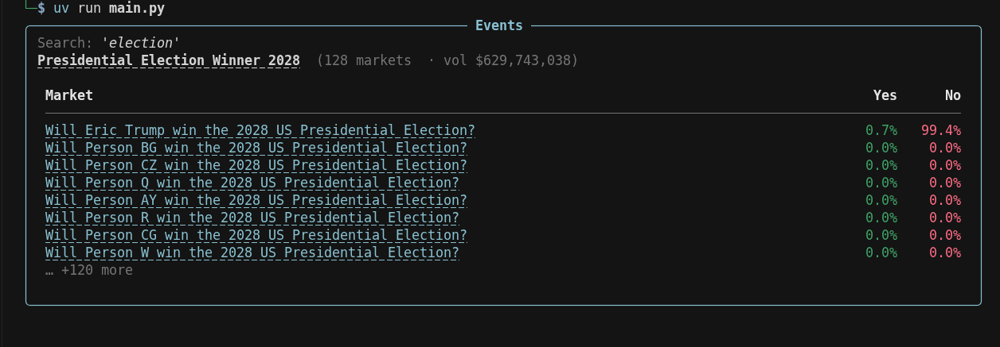

# unipmx

Unified Python toolkit for prediction markets. One client API, multiple venues, terminal display built in.  
Powered by [pmxt](https://github.com/pmxt-dev/pmxt).

<p align="center">
  
  &nbsp;&nbsp;&nbsp;
  
  &nbsp;&nbsp;&nbsp;
  
  &nbsp;&nbsp;&nbsp;
  
</p>

## Whats Unipmx?
Are you tired of juggling mutliple APIs for multiple Prediction markets just to view some basic stuff in a programmatic way? Unipmx unifies multiple prediction markets's Basic Functionalities into 1 dead simple python API menu. 

## Install
Install uv first(if you havent already):  curl -LsSf https://astral.sh/uv/install.sh | sh
```bash
uv add unipmx
```

Or you can also clone the repo if you want to run or edit the source locally:

```bash
git clone <https://github.com/MwkosP/Unipmx>
cd Unipmx
uv sync
```

## Quick start

Pick a Client once — everything else stays the same:

```python
from unipmx import *
from unipmx.Display import *

client = Polymarket()   # or Kalshi(), Gemini(), Limitless() or All() 
```

See `main.py` for the full playground.


## API surface

### Events

Markets, events, series, order books, filters, and market detail — all camelCase Functions easy to access based on your selected Client(Polymarket,Kalshi,Gemini,Limitless or All):

```python
from unipmx.Events import *


client.fetchEvents(query="Bitcoin", limit=10)     #Bitcoin Events
client.fetchMarkets(query, limit=10, sort="volume", status="active")   #Bitcoin Markets
client.fetchSeries(limit=10)

client.fetchEventComments(event_id, limit=20)      # Event's Comments that you cna also view on UI
client.fetchRelatedEvents(event_id, limit=10)

client.fetchMarketOrderBook(market_id)     #Orderbook Rest API snapshot for a specific Market
client.fetchMarketActivity(market_id, limit=20)
client.fetchMarketStats(market_id)
client.fetchMarketGraph(market_id, resolution="1d", limit=48)
client.fetchOrderBookByQuery("btc")
```

### Historical · Users · Feed · Plots

```python
from unipmx.Historical import fetchOhlcv
from unipmx.Users import fetchUserActivity
from unipmx.Feed import watchAddress
from unipmx.Plots import plotChart

display(fetchUserActivity("0x..."), address="0x...")
display(watchAddress("0x...", types=["trades", "positions"]))
plotChart(fetchOhlcv(...), style="candles")
```

## Display

One function renders any return type to a bordered terminal panel:

```python
from unipmx.Display import display

display(client.fetchMarkets("btc", limit=5), query="btc")
display(client.fetchEventComments("31552", limit=20))
display(client.fetchMarketStats(market_id))
```
Example: <br/> <br/>
 <br/>


### Cross-exchange

```python
from unipmx import All
from unipmx.Display import display
from unipmx.Events import *


client = All()   # all venues — or All(("Polymarket", "Kalshi"))

display(client.fetchMarkets("bitcoin", limit=20, sort="volume"))
display(client.fetchEvents("iran", limit=5, sort="volume"))
display(client.fetchMatchedMarkets("btc", limit=10))
display(client.fetchArbitrage("btc", limit=10))
```

## Platforms


| Client         | Platform                                | Auth                                |
| -------------- | --------------------------------------- | ----------------------------------- |
| `Polymarket()` | [Polymarket](https://polymarket.com)    | None / wallet                       |
| `Kalshi()`     | [Kalshi](https://kalshi.com)            | API key + private key (order books) |
| `Limitless()`  | [Limitless](https://limitless.exchange) | API key                             |
| `Myriad()`     | Myriad                                  | —                                   |
| `Probable()`   | Probable                                | —                                   |
| `Smarkets()`   | Smarkets                                | —                                   |
| `All()`        | Every venue above                       | Per-venue                           |


## Venue notes


| Feature                        | Polymarket     | Kalshi               |
| ------------------------------ | -------------- | -------------------- |
| Series ids                     | `"nfl"`, `"1"` | `"FED"`              |
| Event comments                 | Yes            | — (returns `[]`)     |
| Top holders / market positions | Yes            | — (returns `[]`)     |
| Order book                     | Public         | Requires credentials |


Some methods return empty lists on venues without that API instead of raising.

## Project layout

```
unipmx/
├── clients/       # Polymarket(), Kalshi(), All(), …
├── Events/        # REST — markets, events, series, order books
├── Historical/    # OHLCV, trade history
├── Users/         # Wallet trades, positions, balance
├── Feed/          # WebSocket watches
├── Display/       # display() — unified terminal renderer
└── Plots/         # Browser / terminal charts
```

## Env

```bash
# Optional — hosted user endpoints (Polymarket wallet tracking)
export PMXT_API_KEY=your_key
```

## Python

3.12+

## Improvements

Note that it needs a lot of work and it will be improved and have access to many Prediction markets. it is an early version to test it out and also it is NOT for HFT , it is mainly for Longer term - Research oriented Studies / Backtesting Purposes!

## Contributions

Feel free to contribute i love Prediction markets and Coding!